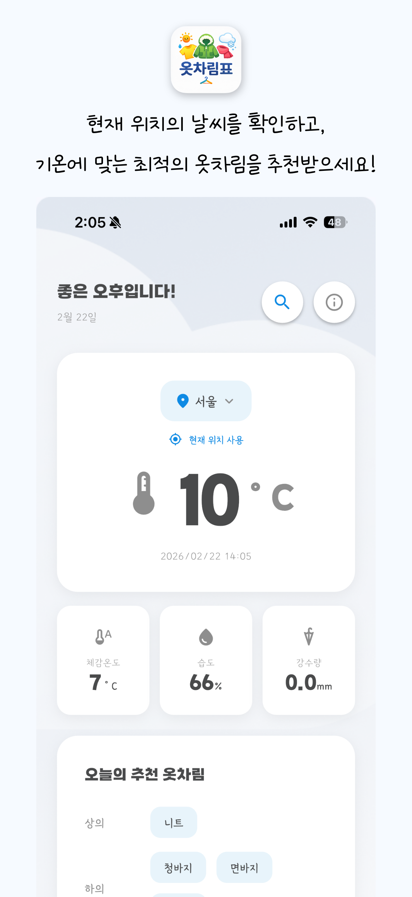
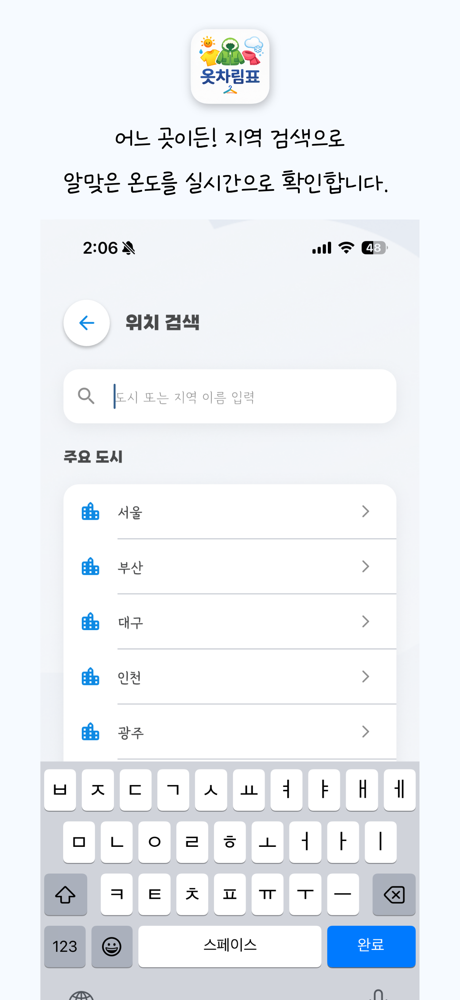
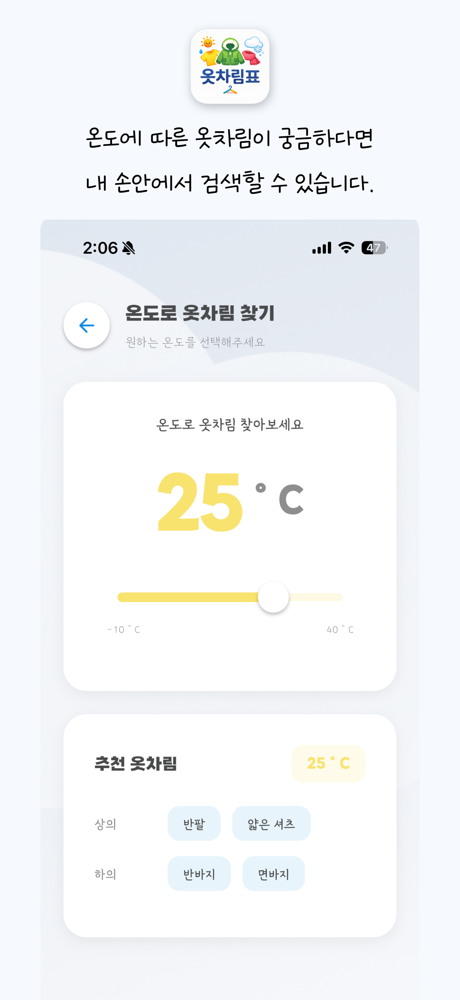

# 옷차림표 (Otcharimpyo)

기온에 맞는 옷차림을 추천해주는 Flutter 앱 🌡️👔

## 📱 스크린샷

<p align="center">
  
  
  
</p>

## 🎯 주요 기능

- 🌡️ **실시간 날씨 정보** - OpenWeatherMap API를 통한 현재 날씨 조회
- 👔 **기온별 옷차림 추천** - 28도 이상부터 영하 5도 이하까지 10단계 추천
- 📍 **위치 검색** - GPS 없이도 원하는 도시의 날씨 확인 가능
  - 12개 주요 도시 빠른 선택 (서울, 부산, 대구, 인천 등)
  - 직접 도시명 검색 기능
- 🎯 **현재 위치 사용** - 위치 권한 허용 시 GPS 기반 정확한 위치 정보
- 🔒 **위치 권한 없이 사용 가능** - 기본 위치(서울)로 앱 이용 가능
- 📱 **플랫폼별 맞춤 안내** - iOS/Android 각각 최적화된 권한 안내

## 🏗️ 아키텍처

**MVVM + MVI + Root 패턴**
```
lib/
├── core/              # 공통 유틸리티
│   ├── error/        # 에러 처리 (Result, Failure)
│   ├── routing/      # GoRouter 설정
│   └── utils/        # 유틸 함수
├── onboarding/        # 온보딩 화면
│   └── presentation/ # 위치 권한 안내
├── location/          # 위치 기능
│   ├── data/         # Location Repository 구현
│   ├── domain/       # Location Model, Repository 인터페이스
│   └── presentation/ # 위치 검색 화면
└── weather/           # 날씨/옷차림 기능
    ├── data/         # Weather API, Repository 구현
    ├── domain/       # Weather Model, UseCase
    └── presentation/ # State, Action, Notifier, 메인 화면
```

### 아키텍처 특징:
- **3계층 분리**: Presentation → Domain → Data
- **단방향 데이터 흐름**: User Action → Notifier → State → UI
- **의존성 역전**: Repository Interface(Domain) ← Implementation(Data)
- **Context 격리**: Root에서만 Context 사용
- **상태 관리**: Riverpod + Freezed를 통한 불변 상태 관리

## 🛠️ 기술 스택

- **Flutter** 3.x
- **Riverpod** - 상태 관리 (Code Generation)
- **Freezed** - 불변 객체 및 sealed class
- **Go Router** - 선언적 라우팅
- **HTTP** - 네트워크 통신
- **Geolocator** - GPS 위치 정보
- **Geocoding** - 주소 ↔ 좌표 변환
- **flutter_dotenv** - 환경 변수 관리

## 🚀 시작하기

### 필수 조건

- Flutter SDK 3.x 이상
- Dart 3.x 이상
- OpenWeatherMap API Key

### 설치

```bash
# 1. 저장소 클론
git clone https://github.com/complete0415Jiyoung/otcharimpyo.git
cd otcharimpyo

# 2. 패키지 설치
flutter pub get

# 3. 코드 생성 (중요!)
flutter pub run build_runner build --delete-conflicting-outputs
```

### 🔑 API 키 설정

#### 1. OpenWeatherMap API 키 발급
1. https://openweathermap.org/ 회원가입
2. API Keys 메뉴에서 키 발급 (무료)

#### 2. 환경 변수 파일 생성
프로젝트 루트에 `.env` 파일 생성:
```env
WEATHER_API_KEY=your_api_key_here
```

**주의:** `.env` 파일은 Git에 올라가지 않습니다. 각자 본인의 API 키로 설정하세요.

### 실행

```bash
# 개발 모드
flutter run

# Android 릴리즈 빌드
flutter build appbundle

# iOS 릴리즈 빌드
flutter build ipa
```

## 🌡️ 기온별 옷차림 기준

| 기온 | 추천 옷차림 |
|------|------------|
| 28°C 이상 | 민소매, 반팔, 반바지, 치마 |
| 23~27°C | 반팔, 얇은 셔츠, 반바지, 면바지 |
| 20~22°C | 얇은 카디건, 긴팔티, 면바지, 청바지 |
| 17~19°C | 얇은 니트, 카디건, 맨투맨, 얇은 재킷 |
| 12~16°C | 재킷, 카디건, 야상, 니트, 스타킹 |
| 9~11°C | 재킷, 트렌치코트, 야상, 니트 |
| 5~8°C | 코트, 히트텍, 니트, 청바지 |
| 4°C 이하 | 패딩, 두꺼운 코트, 목도리 |
| 0°C 이하 | 무지 털린 패딩, 스웨터, 부츠 |
| -5°C 이하 | 파카, 방한 아웃도어 제품 |

## 📱 사용 방법

1. **첫 실행 시**
   - 위치 권한 허용 또는 기본 위치로 시작 선택

2. **위치 변경**
   - 화면 상단 위치명을 탭하여 위치 검색 화면으로 이동
   - 주요 도시 선택 또는 직접 검색

3. **현재 위치 사용**
   - "현재 위치 사용" 버튼 탭
   - 권한 없을 시 설정 화면으로 이동 안내

## 🔒 개인정보 처리방침

본 앱은 사용자의 개인정보를 수집하지 않습니다.
- 위치 정보는 날씨 조회 목적으로만 사용되며 저장되지 않습니다.
- 자세한 내용: [개인정보처리방침](https://complete0415jiyoung.github.io/otcharimpyo-privacy-policy/)

## 🤝 기여하기

1. Fork the Project
2. Create your Feature Branch (`git checkout -b feature/AmazingFeature`)
3. Commit your Changes (`git commit -m 'Add some AmazingFeature'`)
4. Push to the Branch (`git push origin feature/AmazingFeature`)
5. Open a Pull Request

### 개발 가이드

코드 수정 후 자동 생성 (watch 모드):
```bash
flutter pub run build_runner watch --delete-conflicting-outputs
```

테스트 실행:
```bash
flutter test
```

## 📝 라이선스

MIT License

## 👤 개발자

- GitHub: [@complete0415Jiyoung](https://github.com/complete0415Jiyoung)

## 📚 참고 자료

- [Flutter 공식 문서](https://flutter.dev/docs)
- [Riverpod 문서](https://riverpod.dev/)
- [OpenWeatherMap API](https://openweathermap.org/api)
- [Geolocator 패키지](https://pub.dev/packages/geolocator)
- [Geocoding 패키지](https://pub.dev/packages/geocoding)
